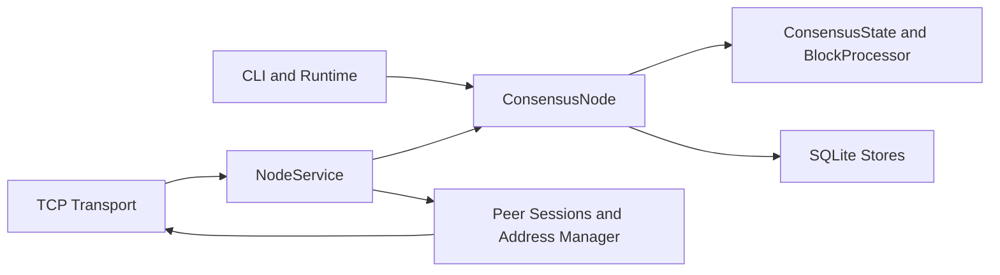

# Architecture

BlockchainCoin is organized as a local full-node core with a UTXO consensus engine, durable SQLite state, a bounded mempool, and an authenticated peer protocol. The architecture is intentionally layered so consensus validity is not spread across storage, CLI, or transport code.

This document describes the academic release baseline. Evaluators should run the UTXO node path, pin release artifacts, verify signatures and hashes, preserve chain parameters, and treat wallets, peer authentication keys, and node databases as research artifacts that must be reproducible and auditable.

## Design Goals

- Keep consensus rules concentrated in `blockchaincoin.consensus`.
- Persist enough state to reopen a node without trusting stale indexes.
- Make mempool policy explicit and separate from consensus validity.
- Prefer deterministic, bounded behavior for peer sync, inventory, and storage.
- Keep release operations reproducible and auditable.
- Make research controls and remaining assumptions visible beside the code.

## Academic Release Model

The academic network model is a permissioned-authenticated research network around a UTXO proof-of-work chain. The shared peer authentication key admits nodes to the wire protocol; chain parameters and genesis allocations define the currency under study; the release manifest and detached signature define the reviewed build.

Minimum academic release records:

- Release version, artifact hashes, detached signature, and release-key fingerprint.
- Genesis allocations, block subsidy, maximum money, starting difficulty, and derived `chain_id`.
- Network name, peer authentication key custody policy, bootstrap peers, and inbound admission limits.
- Wallet custody plan, encrypted wallet locations, backup schedule, and restore procedure.
- Incident commander, release reviewer, audit evidence package, and escalation contacts.

The compatibility account-ledger path remains available for local workflows, but the UTXO node path is the consensus surface for academic evaluation.

## Consensus

The UTXO model represents coins as unspent transaction outputs. A normal transaction consumes one or more `OutPoint` values, proves ownership with input signatures, creates new `TxOutput` values, and pays a fee equal to input value minus output value. A coinbase transaction creates new coins for a block and is only valid in the block position where the processor expects it.

`ConsensusTransaction` and `ConsensusBlock` use canonical binary encodings for transaction IDs, Merkle roots, block header hashes, peer relay payloads, and durable block storage. Supported transaction and block versions are checked before state changes. The `BlockProcessor` validates proof of work, height, parent hash, transaction root, coinbase placement, subsidy plus fee limits, and ordered transaction application.

The most important invariant is atomic state transition: a transaction or block either applies completely to a candidate UTXO snapshot or the live state remains unchanged. This allows mempool admission, block validation, fork validation, and restart replay to share the same rules.

## Storage

The UTXO node stores durable state in SQLite with WAL mode and schema version metadata. `SQLiteForkStore` is the canonical block store for the consensus node. It retains competing branches, tracks cumulative work, and selects the best tip by cumulative work, then height, then hash for deterministic tie-breaking.

`ChainParameters` are persisted with the block database. The derived `chain_id` commits to difficulty, block subsidy, and maximum money. Reopening a database with different parameters is rejected before the stored chain is trusted.

`SQLiteUTXOIndex` is a performance and query index, not a source of consensus truth. On startup, the node replays the selected branch and compares the expected UTXO set with the UTXO snapshot. Missing or stale snapshots are rebuilt. Per-tip UTXO snapshots and spent-output indexes keep branch-local query surfaces available for competing tips.

`SQLiteMempoolStore`, `SQLiteInvalidBlockCache`, and `SQLitePeerSyncStore` persist operational state. Mempool entries are revalidated on restart, invalid block hashes prevent repeated expensive validation, and peer sync counters keep quality scoring stable across process restarts.

## Mempool

The mempool is local relay policy, not consensus. `MempoolPolicy` caps transaction count, serialized size, input/output fanout, minimum relay fee, and minimum fee rate. It also controls direct-conflict replacement and eviction.

Block assembly uses fee-rate prioritization while preserving dependency-valid ordering. After a block import or reorg, the node prunes mempool transactions that no longer validate against the active UTXO set. A transaction rejected by mempool policy can still be consensus-valid if it appears in a valid block.

## Peer Network

The peer protocol uses versioned messages, a network magic prefix, length-prefixed frames, maximum message sizes, and HMAC-authenticated frame tags. There is no unauthenticated peer fallback. The HMAC key is appropriate for private and controlled networks; public deployments still need a broader identity, transport-security, and anti-abuse design.

`PeerSession` owns handshake state, ping/pong liveness, advertised inventory, and session-level validation. `PeerAddressManager` owns connection limits, retry backoff, bans, and deterministic outbound selection. `NodeService` wires sessions to consensus behavior: accepting transactions, importing blocks, answering `getdata`, serving `getheaders`, relaying inventory, and penalizing misbehavior.

Header-first sync validates contiguous header batches before requesting full blocks. Download scheduling only requests blocks for headers anchored to a known local block, suppresses duplicate in-flight work, limits batch size, caps per-peer downloads, retries timed-out blocks, and routes requests toward peers with better persisted sync quality.

## Runtime And CLI

The CLI exposes wallet, initialization, transaction, mining, block, transaction, mempool, balance, and serve workflows. `NodeRuntime` is the lifecycle facade that creates or opens a `ConsensusNode`, attaches a `NodeService`, and starts a TCP server with a required peer authentication key.

Wallets use Ed25519 keys and `bcc_` addresses. Wallet files should be treated as private key material unless encrypted with a passphrase.

## Release And Operations

Release hardening is documented separately:

- [Reproducible Builds](reproducible-builds.md)
- [Release Key Custody](release-key-custody.md)
- [Incident Response](incident-response.md)
- [External Audit Checklist](external-audit-checklist.md)
- [Production Roadmap](production-roadmap.md)

The release process includes pinned constraints, deterministic SHA-256 artifact manifests, detached manifest signatures, public-key fingerprints, Ruff, Pyright, coverage, compileall, and package build gates.

Evaluators should retain the release manifest, detached signature, release public-key fingerprint, source revision, chain parameters, genesis transaction, and experiment checklist as permanent research records. Any emergency release must follow the incident-response process and include a failing regression test for the defect that triggered it.

## Invariants

- Consensus validity lives in `ConsensusState` and `BlockProcessor`.
- Transaction IDs and block hashes are derived from canonical binary codecs.
- A block must connect to the expected parent and satisfy its own difficulty.
- Coinbase output value must not exceed subsidy plus included transaction fees.
- The UTXO set must never exceed `max_money`.
- Fork choice is cumulative-work based and deterministic.
- A persisted UTXO snapshot must match replayed state before it is trusted.
- Mempool policy rejection is distinct from consensus rejection.
- Peer `headers` batches must be contiguous, sequential, supported-version, and proof-of-work valid.
- Full block downloads are scheduled only from headers anchored to known blocks.
- Peer frames are HMAC-authenticated and bounded by size.

## Boundaries

This architecture is suitable for a controlled academic release where participating peers share an authentication key and evaluators follow the release, custody, backup, monitoring, and incident-response controls in this repository. It is not a claim that arbitrary public Internet participation is safe without additional identity, denial-of-service, governance, and economic-policy work.

External review is part of the academic release rather than a one-time milestone. The [External Audit Checklist](external-audit-checklist.md) defines the evidence package expected for independent reviewers, and accepted findings should be fixed, regression-tested, and reflected in the roadmap before any network expands trust or economic exposure.
